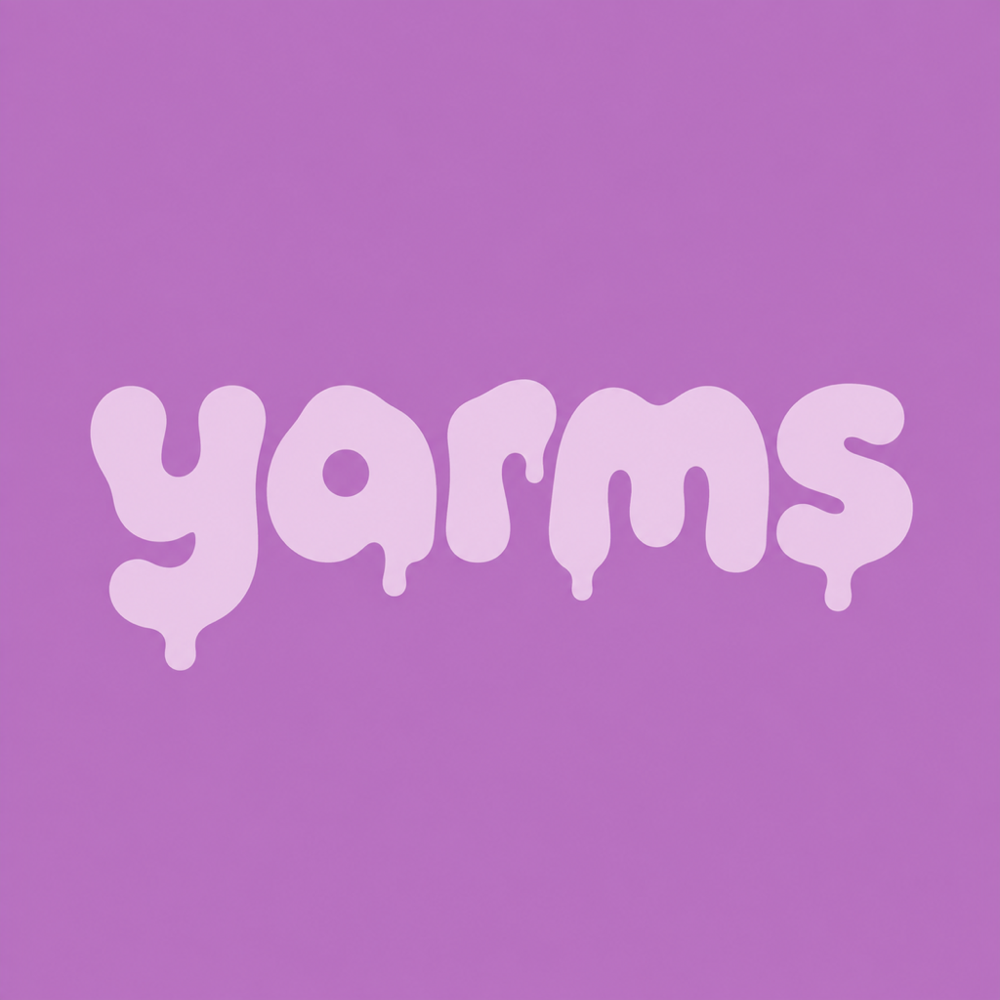

<p></p>

# yarms

[](https://github.com/joshuawyadao/yarms/actions/workflows/ci.yml)
[](LICENSE)

Save TikTok workouts, organize them into folders, and follow along on your iPhone. Keep your own notes and export your library when you need a backup.

> **Available from source:** The MVP is implemented for iOS 18 or later. There is no App Store or TestFlight release; install with Xcode using the [development guide](docs/Development.md).

## Start here

| I want to… | Read |
| --- | --- |
| Save, organize, watch, or back up workouts | [User guide](docs/User-Guide.md) |
| Install on an iPhone or run the simulator | [Development and setup](docs/Development.md) |
| Find the right file to change | [Repository map](docs/Repository-Map.md) |
| Design a consistent, accessible UI | [Design language](docs/Design-Language.md) |
| Understand how the app works | [Architecture and diagrams](docs/Architecture.md) |
| Understand stored data and network access | [Data, backups, and privacy](docs/Data-and-Privacy.md) |
| Browse all documentation | [Documentation index](docs/README.md) |

## From TikTok to your library

1. In TikTok, tap **Share → Save to yarms**. Open Yarms to import the saved link. You can also copy a video link and use **Paste** in Yarms.
2. Find it in **Unfiled**, move it into a folder, or search by title, creator, or link.
3. Open the workout to watch with TikTok's embedded player and save optional notes. **Open in TikTok** remains available if inline playback fails.
4. Use **Backup → Export backup** to save links, notes, and folders to Files.

No Yarms account or Shortcut is required. Yarms saves links rather than video files; playback and metadata depend on TikTok and the post remaining available. Backups are unencrypted and include your notes. See the [user guide](docs/User-Guide.md) for restore limits, deletion behavior, and troubleshooting.

**Upgrading an old App Group build?** [Export and check your backup before installing](docs/Storage-Migration.md). The current build cannot read that old storage location directly.

The [yarms design language](docs/Design-Language.md) combines a cool-pink palette, native controls, and gentle invitations to save and try enjoyable workouts. Colors follow light/dark appearance and Increase Contrast; larger text uses stacked cards and a full folder picker.

## Work on Yarms

```sh
git clone https://github.com/joshuawyadao/yarms.git
cd yarms
./scripts/verify-repository.sh
open Yarms.xcodeproj
```

Select the **Yarms** scheme and an available iPhone simulator. For physical-device signing, project regeneration, and command-line builds, follow [Development](docs/Development.md). The [testing guide](docs/Testing.md) covers unit/UI tests, CI, and checks that need a signed iPhone.

Read [CONTRIBUTING.md](CONTRIBUTING.md) before opening a PR. Use invented examples; keep personal workout collections, health information, credentials, videos, and private screenshots out of this public repository. Report vulnerabilities through [SECURITY.md](SECURITY.md), and follow the [Code of Conduct](CODE_OF_CONDUCT.md).

## Project status and license

The [roadmap](docs/MVP-Roadmap.md) explains the delivered scope; [MVP progress](docs/MVP-Progress.md) records merged work and historical validation. Current testing limitations are listed in [Testing](docs/Testing.md).

Yarms is released under the [MIT License](LICENSE). This public repository makes its design and development reviewable. TikTok is a trademark of its respective owner; Yarms is independent and unaffiliated.
