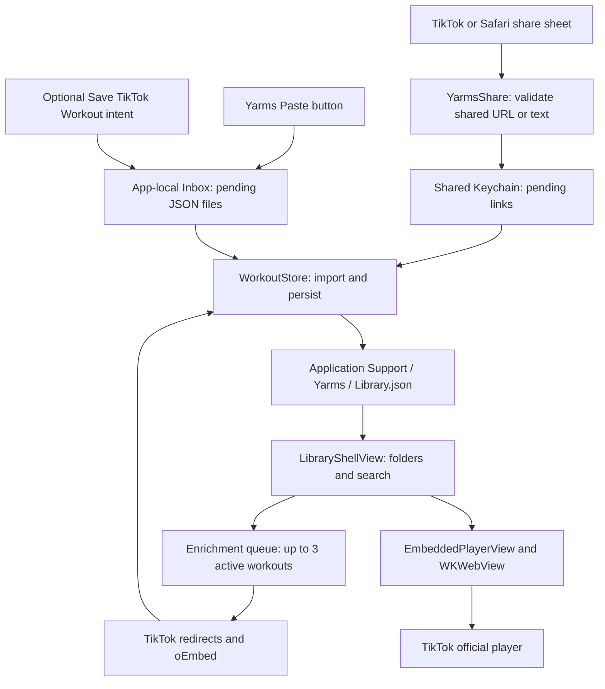
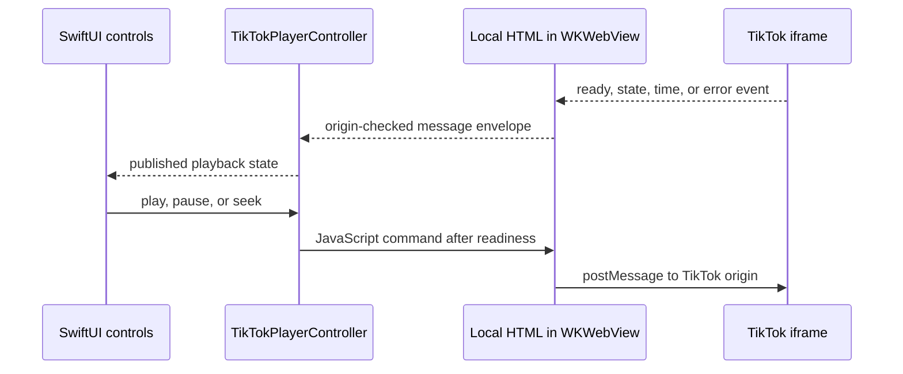

# Architecture

[Documentation index](README.md) · [Repository map](Repository-Map.md) · [Data and privacy](Data-and-Privacy.md) · [Testing](Testing.md)

Yarms is a SwiftUI iPhone app with a UIKit Share extension. The app owns a JSON library; the extension hands off small link records through Keychain. There is no Yarms backend, account service, or video download pipeline.

## Components and boundaries

The diagram separates capture from enrichment: saving only needs a valid link and writable local storage. Metadata and playback happen later and can fail without removing the link. Thumbnails may be fetched from HTTPS URLs returned by oEmbed; the diagram groups those external services under TikTok. See [network boundaries](Data-and-Privacy.md#network-boundaries) for the precise scope.

| Area | Responsibility |
| --- | --- |
| `YarmsCore/` | URL parsing and the two pending-link queues; compiled into both app and extension, not a separate framework |
| `YarmsShare/` | Receive URL/text attachments, validate a link, enqueue it, then finish or show an error |
| `YarmsApp/` | Library UI, capture intent, persistence/restore, enrichment scheduling, and player integration |
| `YarmsTests/`, `YarmsUITests/` | Store and protocol checks, local WebKit controller tests, and simulator user journeys |

The [repository map](Repository-Map.md) identifies every source file. Project settings, target membership, and generator behavior are covered in [Development](Development.md).

## Capture and durable import

1. `TikTokLink` scans URL candidates in shared text until it finds a supported TikTok video or short link. It requires HTTPS and an accepted host, rejects credentials and explicit ports, and removes query/fragment data.
2. The Share extension stores a `PendingLink` in `KeychainInbox`. The app's Paste action and optional `SaveTikTokWorkoutIntent` use the file-backed `SharedInbox`.
3. `LibraryShellView` refreshes on appearance and when the app becomes active. `WorkoutStore.importPending()` reads the file inbox, then the Keychain inbox.
4. For each new record, the store saves the library atomically **before** acknowledging/removing the pending record. Already-known records can be acknowledged directly. An interrupted acknowledgement can be replayed without duplicating the workout.
5. New shares are Unfiled. On foreground/paste, a new workout switches the folder selection to Unfiled; search text is retained, so a search can still hide it.

The app and extension share a Keychain entitlement and signing team. They do not use an App Group. Only the app writes `Library.json`. A process-wide recursive lock serializes store read/modify/write operations; it is not an interprocess database lock. If the library cannot be decoded, import fails before queued entries are removed. Malformed file-inbox JSON is skipped and retained; a malformed Keychain payload makes that queue's load throw.

## Enrichment and identity

The queue selects workouts missing a title, thumbnail, or canonical video ID and keeps at most three enrichment tasks active. Creator absence alone does not trigger a retry. Refresh can queue incomplete records again; there is no persistent background retry service.

`TikTokMetadataClient` tries at most five HEAD requests for a short link, with a 10-second per-request timeout. Automatic redirect following is disabled for these requests. Each next URL must pass `TikTokLink` validation before it is requested. A canonical numeric video ID enables the player; failed resolution leaves the original source link available.

The client then requests TikTok's [oEmbed metadata](https://developers.tiktok.com/docs/en/embed-videos), even if short-link resolution failed. Available title, creator, and thumbnail fill missing fields; they do not overwrite existing values.

When links resolve to the same video ID, the store keeps the earliest saved identity (UUID breaks equal-time ties). It fills missing details and an empty folder assignment from duplicates, combines notes, and records locally confirmed source aliases. A late enrichment response for a removed duplicate can find the survivor by video ID. Detailed matching and note precedence are in [Data and privacy](Data-and-Privacy.md#restore-and-duplicate-rules).

## Library and workout presentation

`LibraryShellView` owns selection, search, dialogs, backup pickers, and enrichment scheduling. All/Unfiled/folder filtering runs before `Workout.matches` searches title, creator, and source/resolved/alias links. Folder counts and ID-to-name lookup are prepared before rendering rows.

The [design language](Design-Language.md) defines the UI rules. `YarmsTheme` owns adaptive color roles, spacing, radii, button styles, and target/content sizes; `YarmsUIComponents` supplies folder badges/filters, adaptive workout-card content, and empty states. Screen views retain persistence, navigation, and playback responsibilities. [Design and assets](Design-and-Assets.md) covers icon and asset maintenance.

The welcome, native Paste control, folder section, and workout cards share one vertical list capped at 600 points. Welcome copy invites saving and trying workouts, and disappears during search. Paste remains available with an empty library or zero matches. At accessibility text sizes, cards stack their thumbnail and text; missing titles get a distinguishing source-link subtitle.

Folder browsing uses a full-height native picker sheet at accessibility text sizes, above six named folders, or when a name exceeds 24 characters. Otherwise horizontal chips show counts and selected checkmarks. Both presentations expose selected accessibility traits. Cool-pink assets adapt to light/dark appearance and Increase Contrast.

The workout screen places its title and folder above the portrait player. Compact playback controls and a full-width Open in TikTok fallback sit in a bottom safe-area tray; notes use scalable native editing with keyboard Done. The Share extension uses a native activity indicator and wrapping Dynamic Type status on a system background while the pending link is saved.

`EmbeddedPlayerView` owns a snapshot of the selected workout and local note/folder editor state. Successful note saving refreshes the parent library so a later opening sees the saved value. Deletion only dismisses the workout screen after `WorkoutStore.remove` reports success. If enrichment removed that identity by coalescing it, the UI refreshes and asks the user to select the surviving workout again.

## Player bridge

`TikTokPlayerHTML` builds a local host around the [official embed player](https://developers.tiktok.com/docs/en/embed-player), with TikTok's controls enabled. JavaScript accepts messages from `https://www.tiktok.com` with the player marker. Native parsing additionally requires the host's main frame, expected envelope/type, and finite nonnegative times. Commands target TikTok's origin; normal UI controls remain disabled until ready or after a reported player error.

Duration may arrive in a ready or time event. Relative seeking is bounded at zero and at known duration. Replay seeks to zero. `WKWebView` enables inline media playback, and its handler is removed when dismantled. The always-available external link is the fallback for unavailable posts or unresolved short links. Yarms does not persist a video file, though WebKit and networking can use system-managed caches.

## Backups and failure boundaries

`WorkoutBackup` validates user-selected JSON, `WorkoutStore` performs the additive merge, and `WorkoutBackupDocument` supplies the Files exporter. UI confirmation occurs after the selected file passes validation. Restore writes the merged library atomically and then follows the normal refresh/enrichment path.

See [Data and privacy](Data-and-Privacy.md) for the schema, size limits, sanitization, and restore diagram. See [Storage migration](Storage-Migration.md) before replacing an old App Group build.

| Failure | Preserved behavior |
| --- | --- |
| Invalid shared link | No pending record is added |
| Share Keychain write fails | Extension shows an error instead of reporting completion |
| Library read/write fails | Error is surfaced; import does not acknowledge a new unsaved record |
| Metadata, redirect, or thumbnail fails | Saved link remains; incomplete enrichment can retry on refresh |
| Embedded player fails | Open in TikTok remains available; the post may also be unavailable there |
| Backup validation or merge fails | Restore does not commit a partial merged library |
| Selected record was coalesced during editing/deletion | UI reports failure and asks the user to reopen/reselect |

## Verification and current limits

[Testing](Testing.md) is the canonical guide for automated coverage, commands, benchmarks, and signed-device checks. Simulator tests exercise local protocol behavior; they do not prove TikTok's live availability or cross-process Share Sheet signing. The Notes-focus frame warning also reproduces in a minimal native SwiftUI text editor with a keyboard toolbar on iOS 26.5 and 27.0; the controlled experiments and limits are documented there. No player-geometry change was justified by that diagnostic.

## Vocabulary

| Term | Meaning here |
| --- | --- |
| Workout | A saved TikTok link plus local details, notes, and optional folder; not a downloaded video |
| Pending link / inbox | A durable capture waiting for the app to import it |
| Canonical link | A supported video URL carrying a numeric video ID |
| Enrichment | Resolving a short link and requesting available metadata |
| Coalescing | Combining locally recognized duplicates into a surviving workout |
| Source alias | Another URL locally confirmed to identify the same video |
| Unfiled | A workout with no folder ID; not a stored folder record |
| Restore | An additive validated merge, not a replacement of the current library |
