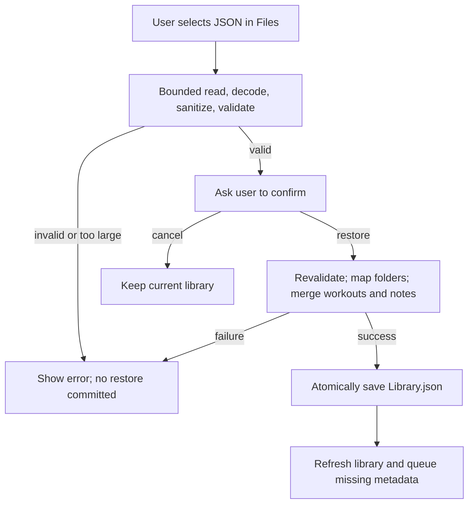

# Data, backups, and privacy

[Documentation index](README.md) · [Architecture](Architecture.md) · [Backup instructions](User-Guide.md#export-and-restore)

This page describes the checked-in implementation. Source contracts live in [Workout](../YarmsApp/Workout.swift), [WorkoutStore](../YarmsApp/WorkoutStore.swift), and [WorkoutBackup](../YarmsApp/WorkoutBackup.swift). Yarms has no app account, analytics SDK, or server-side library in this repository.

## Where data lives

| Data | Location and lifetime |
| --- | --- |
| Workouts, metadata URLs, notes, folders, confirmed aliases | App container: `Application Support/Yarms/Library.json`; retained until edited/deleted or the app's data is removed |
| Links captured by Paste or App Intent | `Application Support/Yarms/Inbox/<UUID>.json`; removed after successful import or duplicate acknowledgement |
| Links captured by Share extension | Shared Keychain, service `com.joshuawyadao.yarms.pending-links`; one generic-password item per pending UUID, removed after import/acknowledgement |
| Exported backup | JSON at the user's chosen Files location; deletion in Yarms does not update or delete earlier exports |
| UI test library | Temporary `YarmsUITests/<UUID>` directory selected with `-YarmsUITestStoreID`; normal Keychain import is disabled for this mode |
| Web content and image responses | Managed by WebKit/URLSession/SwiftUI system behavior; not a Yarms video archive |

Keychain entries are limited to 4,096 encoded bytes and use `kSecAttrAccessibleAfterFirstUnlockThisDeviceOnly`. This setting applies to the pending-link queue, not to the file-backed library. There is no app-level encryption layer for `Library.json` or exported JSON. The implementation does not configure a Yarms cloud-sync service; iOS backup and a Files provider's behavior are outside this app's restore mechanism. Do not treat reinstalling or deleting the app as a supported data-recovery method.

The legacy App Group location is no longer accessible to this build. Follow [Storage migration](Storage-Migration.md) before upgrading from that version.

## Stored format

Local library and backup envelopes contain `schemaVersion`, `workouts`, and `folders`. Current writes use **schema 2**. JSON encoding uses Foundation's default date strategy: numeric seconds since **2001-01-01 00:00:00 UTC**, not Unix time or ISO 8601 strings. Optional fields can be omitted. Export uses sorted object keys, but array order and file bytes are not a stable API.

| Record | Fields |
| --- | --- |
| `TikTokLink` | `url` string; optional `videoID` string |
| `PendingLink` | `id` UUID, `link` TikTokLink, `savedAt` date |
| `Workout` | Required `id`, `sourceLink`, `savedAt`; optional `resolvedLink`, `title`, `creator`, `thumbnailURL`, `notes`, `folderID`, `sourceAliases` |
| `WorkoutFolder` | `id` UUID and `name` string |

`playbackLink` is computed as resolved link or source link, not stored separately. All and Unfiled are UI filters; only user-created folders have records. Folder names are trimmed, 1–80 characters, contain no control characters, and are unique using case/diacritic folding with `en_US_POSIX`.

A minimal **synthetic, folder-only** schema 2 backup illustrates the envelope without including a real workout link:

```json
{
  "schemaVersion": 2,
  "workouts": [],
  "folders": [
    { "id": "00000000-0000-4000-8000-000000000001", "name": "Example folder" }
  ]
}
```

Use the app's exporter for real backups. Hand-edited files can fail validation or misrepresent relationships.

## Version compatibility

| Input | Current behavior |
| --- | --- |
| Schema 1 library without folders | Loads; future writes use schema 2 |
| Early schema 1 local library containing folders | Upgrades to schema 2 immediately on read |
| Schema 1 backup without folders/assignments | Accepted |
| Schema 1 backup carrying folders/assignments | Rejected to prevent older builds silently losing organization |
| Schema 2 library or backup | Current format |
| Other version or malformed JSON | Rejected; no automatic repair |
| New schema 2 file opened by pre-folder builds | Those builds reject the unsupported version |

Local loading is decoding plus version handling; it is not the full untrusted-backup validation path. Do not infer that arbitrary edited local JSON has passed backup validation.

## Backup import boundary

The importer checks file size before reading when available, then reads in bounded chunks to detect overflow even if that size was unavailable or changed. The maximum accepted input is **10 × 1,024 × 1,024 bytes**. Export has no matching size cap: it preserves every record and the UI warns if the result exceeds the restore limit.

Import normalizes blank optional title/creator/notes to absent values, trims folder names, and validates:

- Supported schema and decodable required fields.
- Unique workout UUIDs; unique folder UUIDs and normalized names.
- Finite save times and folder references that point to included folders.
- Source links that exactly match the supported parser's normalized URL and video ID.
- Retained canonical resolved links with a numeric ID matching the source video's ID.

**Imported claims are sanitized before use:** thumbnail URLs and source aliases are discarded, and resolved links for short-link sources are cleared. The app re-fetches these through its own enrichment path. A canonical source's matching canonical resolution can be retained. This avoids trusting a backup's claim that an arbitrary URL or unrelated video belongs to a workout.



In words: validation precedes confirmation, and the store revalidates the archive before merging. A failed merge does not save a partially restored collection. Network enrichment follows the local commit, so network failure does not undo a completed restore.

## Restore and duplicate rules

| Area | Rule |
| --- | --- |
| Folder matching | Match normalized names to current folders; create missing names and remap colliding incoming folder IDs |
| Workout matching | Indexed UUID, source URL, locally confirmed aliases, and available canonical video ID; incompatible identity claims reject the merge |
| Existing details | Keep current identity/details; fill missing title, creator, resolution, and folder assignment |
| New workouts | Add validated records; imported aliases do not establish identity |
| Short-link enrichment | When saved links resolve to one video, retain the earliest save's identity, then fill missing details/folder from duplicates |
| Deletion | Removes that local workout record; no tombstone prevents a later share or older backup from adding it again |

**Note precedence matters.** Restore keeps the current workout's note first, even if the incoming backup record has an earlier save time. Incoming records are considered in save order. Enrichment coalescing starts with the earliest saved workout's note instead.

Both paths share a paragraph-occurrence merge policy: blank-line-separated paragraphs from later notes are appended only when that occurrence is missing from the earlier note. Intentional repeated paragraphs inside either note are retained; partial text matches are distinct. For example, current `Warm up` plus imported `Warm up` / `Stretch` becomes `Warm up` / `Stretch`. Restoring that archive again adds no more copies. The helper streams paragraph ranges rather than allocating an array for every delimiter in a large note.

A successful restore reports added workouts and updated/combined existing records; it does not count added folders as workouts. Re-importing the same archive does not keep duplicating records or notes. Confirmed aliases persist locally for later capture/restore matching, but an exported alias is untrusted when imported elsewhere.

## Network boundaries

| Operation | Request/data boundary |
| --- | --- |
| Share capture | Parses URL/text locally and writes Keychain; no metadata fetch in the extension |
| Short-link resolution | Up to five HEAD requests; each next URL must be an accepted HTTPS TikTok link; automatic redirects disabled for this path |
| Metadata | GET to `https://www.tiktok.com/oembed` with the workout URL as the `url` query parameter |
| Thumbnail | `AsyncImage` loads an HTTPS thumbnail URL returned by TikTok metadata; its host need not be `tiktok.com` |
| Playback | `WKWebView` loads TikTok's official iframe player and its web resources |
| Open in TikTok | iOS opens the saved/resolved URL in an available app or browser |

Accepted input hosts are `tiktok.com`, `www.tiktok.com`, `m.tiktok.com`, `vm.tiktok.com`, and `vt.tiktok.com`, with supported video/short-link path shapes. Query strings and fragments are removed from captured links. This input/HEAD-redirect allowlist is **not** a global network sandbox: oEmbed, thumbnail loading, and embedded web content use their own networking behavior.

Yarms does not include notes or folder names in its TikTok requests, upload the library to its own service, or download a reusable video file. TikTok and its content providers can still receive normal network requests and process web-player data; “local library” does not mean offline or anonymous playback.

## Sharing evidence safely

Never publish a real backup, pending-link record, device log, private screenshot, credential, or personal workout collection. Use invented examples in tests/issues, and keep exported files private. The repository verifier checks a limited set of sensitive/generated file extensions; it cannot prove a JSON file or screenshot is safe. Report vulnerabilities using [SECURITY.md](../SECURITY.md).
